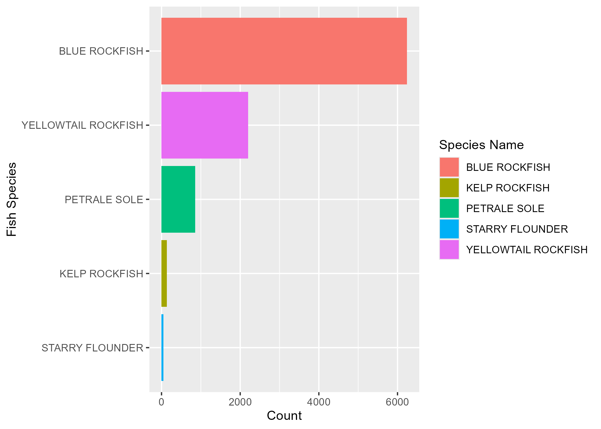
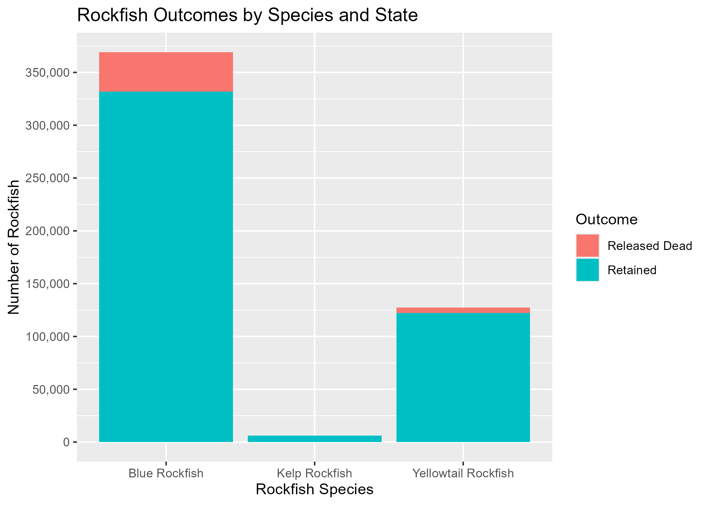

## Final Portfolio

### Data Description
For my project I used data from the Recreational Fisheries Network official website, or [RecFin](https://www.recfin.org/)

### Data Cleaning
To clean my data, I focused first on making sure all variables were titled the same for continuity purposes. I then selected the specific variables I wanted to work with for the purposes of my project and mutated my data to create a new variable that looked at the ratio between weight and length of Rockfish to gain a general understanding differences between species. I did this with more than one dataset, and then put these two sets together to make it easier to create graphics from both.

```{r}
#| include: false
library(tidyverse)
library(janitor)
```


```{r}
#| include: false
fish1 <- read.csv("data-raw/SD001--2025.csv")
mortality <- read.csv("data-raw/CTE002-2025.csv")
fish2 <-read.csv("data-raw/SD001-CALIFORNIA-2025.csv")
```

```{r}
#| include: false
fish1 <- fish1 |> 
  clean_names()
fish2 <- fish2 |> 
  clean_names()

fish1_clean <- fish1 |> 
  select(recfin_imputed_weight_kg, recfin_length_mm, species_name) |> 
  mutate(ratio = recfin_imputed_weight_kg/recfin_length_mm) |> 
  drop_na()

fish2_clean <- fish2 |> 
  select(recfin_imputed_weight_kg, recfin_length_mm, species_name) |> 
  mutate(ratio = recfin_imputed_weight_kg/recfin_length_mm) |> 
  drop_na()
species_count <- fish2_clean 
  

all <- bind_rows(fish1_clean, fish2_clean)

species_count <- all |> 
  count(species_name, name = "count")
```

```{r}
#| include: false

mortality <- mortality |> 
  clean_names() 
```
### Visualization 1
This visualization shows the overall count comparison between all fish species in my data set, including Blue Rockfish, Yellowtail Rockfish, Petrale Sole, Kelp Rockfish, and Starry Flounder. Blue Rockfish had the highest count by far while Starry Flounder had close to none by comparison, with Yellowtail Rockfish having the second highest count but not even summing to half of what Blue Rockfish had.

```{r}
#| include: false
species_count |> 
  ggplot(mapping = aes(x = reorder(species_name, count), y= count,
                       fill = species_name)) +
  geom_col() +
  coord_flip() +
  labs(x = "Fish Species",
       y = "Count",
       fill = "Species Name")
ggsave("plot1.png")
```



### Visualization 2
My second visualization displays the outcomes of Rockfish species once they're initially caught. The graphic displays how once again, Blue Rockfish by far had the highest amount of catches, as is to be expected with California and Oregon fish. The overall pattern of note is that at least 90% of each of the Rockfish caught were then retained for what could be a number of purposes, be it for food, or for recreation. Kelp Rockfish by far had the lowest count of catches between all three species. This may be due to general lack in abundance, which could be cause for a new research question looking at Rockfish species abundance overall across these states and see if there's a significant difference in these numbers.

```{r}
#| include: false
mort_long <- mortality |> 
  select(species, california_retained_num, california_released_dead_num, oregon_retained_num, oregon_released_dead_num) |> 
  pivot_longer(
    cols = -species,
    names_to = "type",
    values_to = "count") |> 
  mutate(state = if_else(str_detect(type, "california"), "California", "Oregon"),
    outcome = case_when(
      str_detect(type, "released_dead") ~ "Released Dead",
      str_detect(type, "retained") ~ "Retained"
    )
  )
```

```{r}
#| include: false
mort_long |> 
  ggplot(aes(x = species, y = count, fill = outcome)) +
  geom_col() +
  scale_y_continuous(
    labels = scales::comma,
    breaks = scales::pretty_breaks(n = 10)
  ) +
  labs(x = "Rockfish Species",
       y = "Number of Rockfish",
       fill = "Outcome",
       title = "Rockfish Outcomes by Species and State")
ggsave("plot2.png")
```


